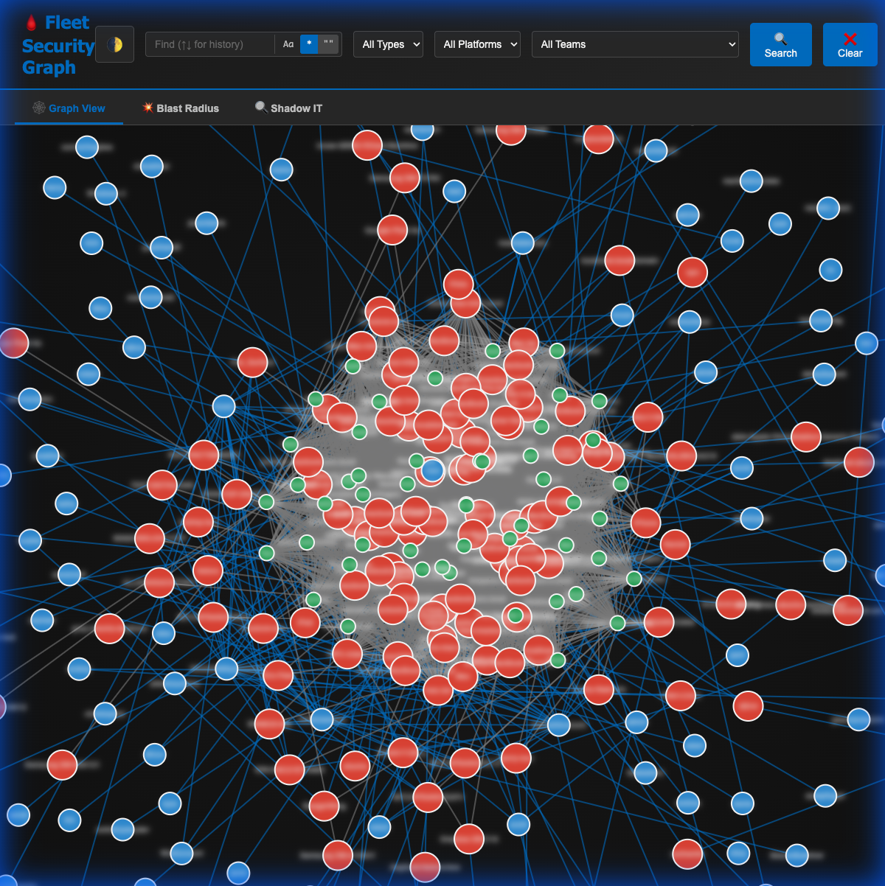
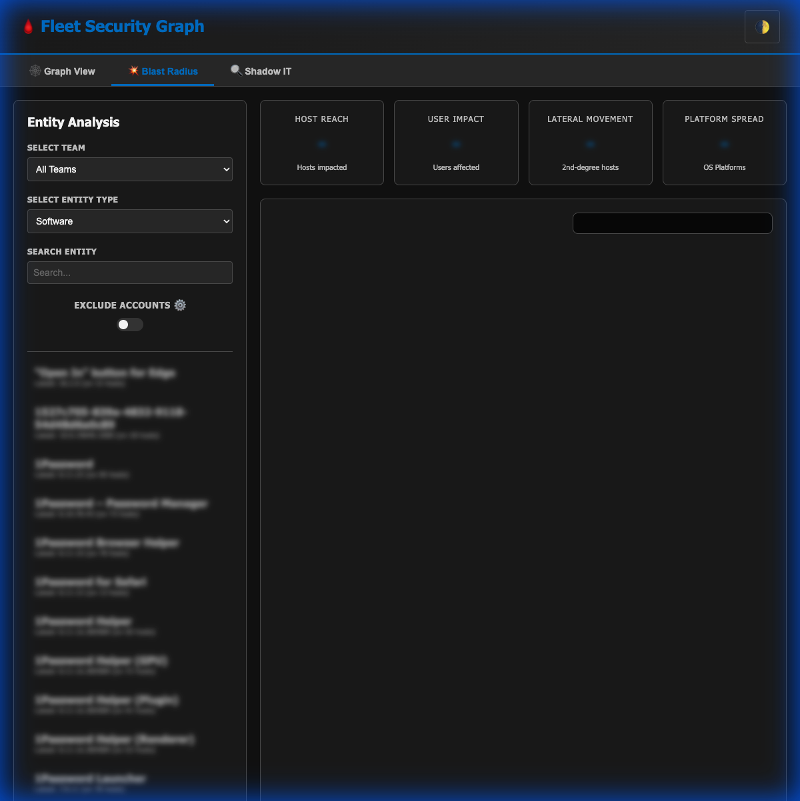
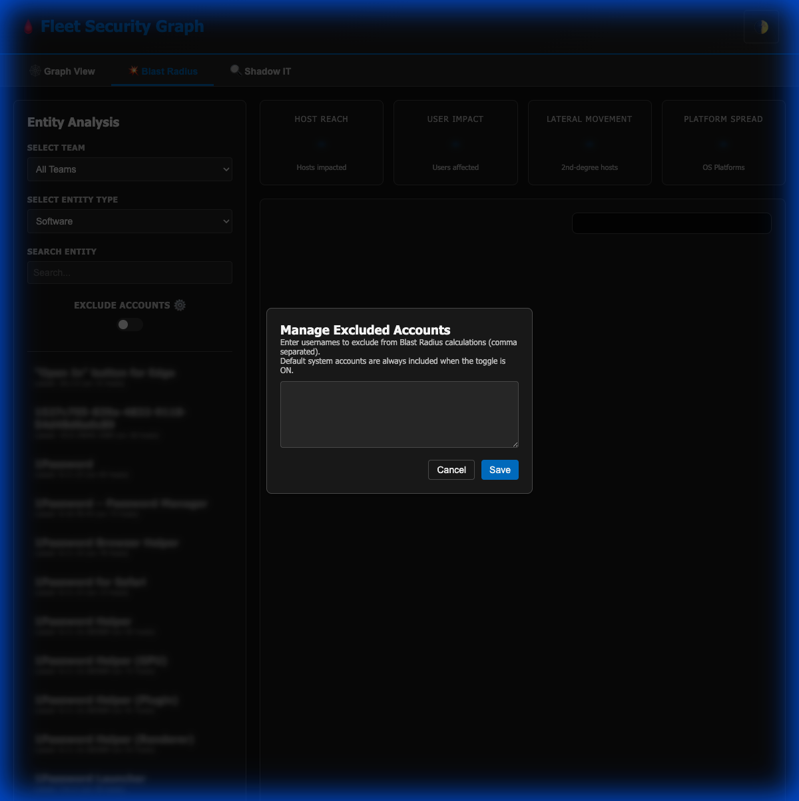
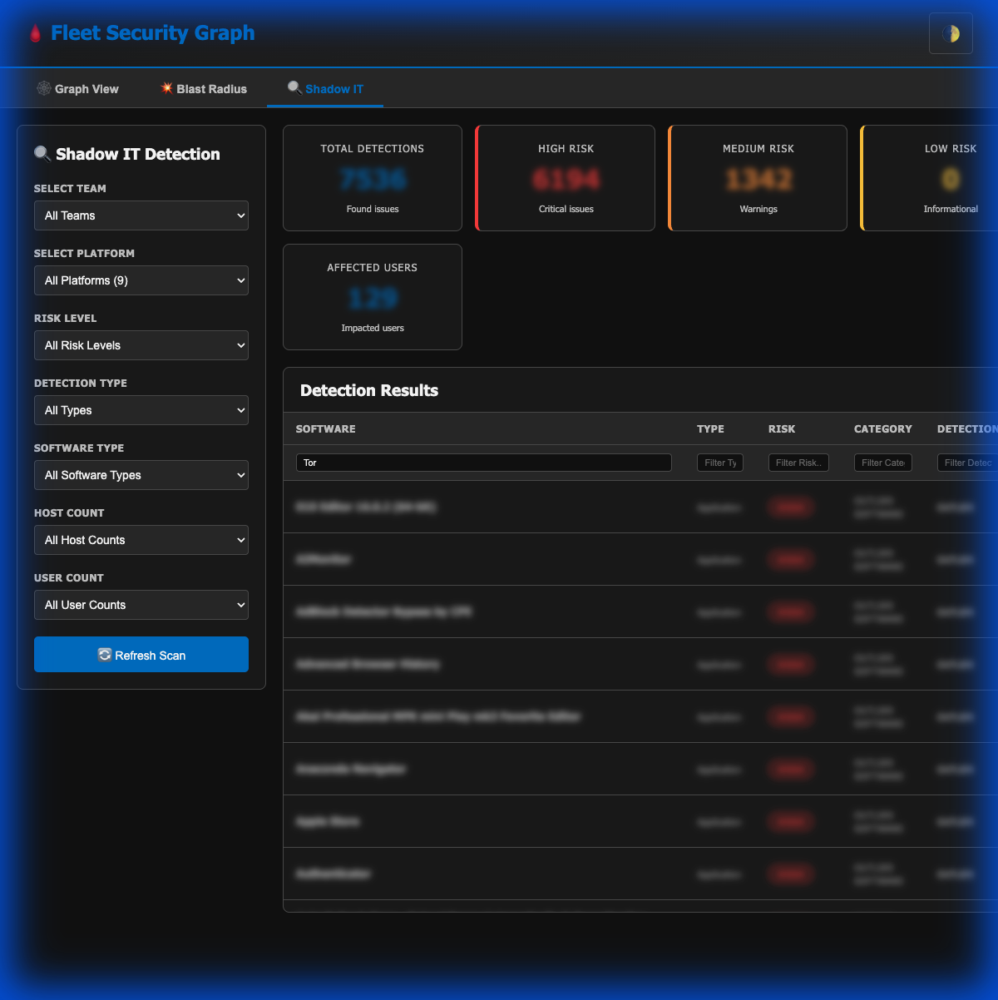
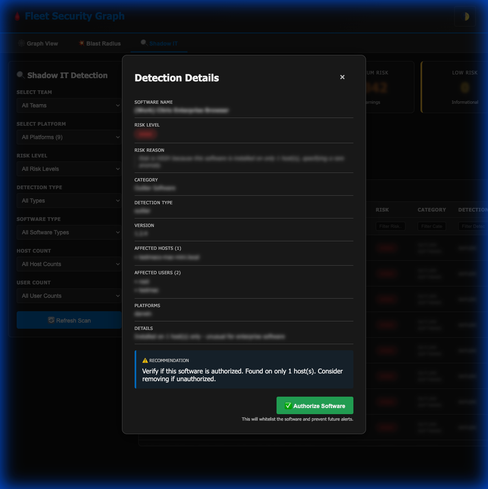
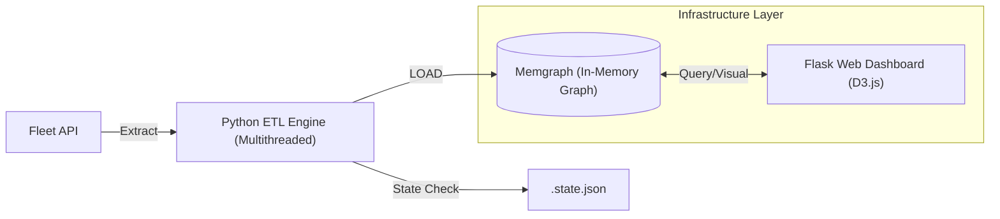

# Fleet Hound 🩸🐶
> **High-Performance Infrastructure Graph Analysis & Risk Quantization for Fleet.**

[](https://github.com/fleetdm/fleet)
[](https://fleetdm.com)
[](https://memgraph.com)

---

## 🛡️ Executive Summary

**Fleet Hound** is a tier-one security asset designed for Vulnerability Management, Incident Response, and GRC teams. It transforms passive inventory data from **Fleet** into an interactive, multi-dimensional **Security Graph**, enabling teams to visualize hidden relationships, quantify attack vectors, and identify Shadow IT at scale.



---

## ⚡ Core Capabilities

### ⚛️ Blast Radius & Impact Quantization
*Quantify the "So What?" of a compromise.*
- **Lateral Movement Modeling**: Mathematically identify potential pivot points from any compromised node.
- **Dynamic Risk Radar**: Visualize impact across Host Reach, User Exposure, and Platform Diversity.
- **Smart Exclusion Engine**: Tunable whitelisting to filter out system noise (e.g., service accounts).

<p align="center">
  
  
</p>

### 🕵️ Shadow IT & Anomaly Detection
*Reveal the "Unknown Unknowns" in your desktop and server fleet.*
- **Software Outlier Analysis**: Automatically flag applications installed on a statistically insignificant number of hosts.
- **High-Risk Category Tagging**: Instant identification of unauthorized Remote Access, File Sharing, and Dev tools.
- **Version Sprawl Detection**: Identify fragmentation risks where outdated versions persist despite patching policies.

<p align="center">
  
  
</p>

---

## 🏗️ Technical Architecture

Fleet Hound utilizes a high-performance ETL pipeline to bridge device management and graph theory.



---

## 📦 Rapid Deployment

### 1. Environment Preparation
```bash
cp .env.example .env
# Configure FLEET_URL and FLEET_API_TOKEN
```

### 2. Orchestration
```bash
./start.sh
```
- **Web Dashboard**: `http://localhost:8080`
- **Bolt Protocol**: `bolt://localhost:7687`

### 3. Data Synchronization
| Mode | Command | Frequency |
| :--- | :--- | :--- |
| **Full Baseline** | `python3 main.py --full-scan` | Weekly / Initial |
| **Delta Sync** | `python3 main.py` | Hourly / On-Demand |
| **Targeted Sync** | `python3 main.py --teams 5` | Per Incident |

---

## 🔐 Data Privacy & Sanitization
*Fleet Hound is designed with privacy-first principles.*
- **Local Sovereignty**: All graph data remains within your local Docker volumes.
- **Sanitized Exports**: Built-in capabilities to obscure PII (Usernames/Hostnames) for reporting.
- **Audit Logs**: All whitelisting/authorization actions are recorded in `audit.log`.

---

## 📄 Governance
Licensed under the **MIT License**. Maintained for modern security operations.
*Built for Security Engineers. Loved by Risk Professionals.*
