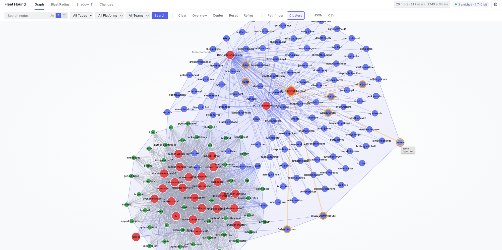
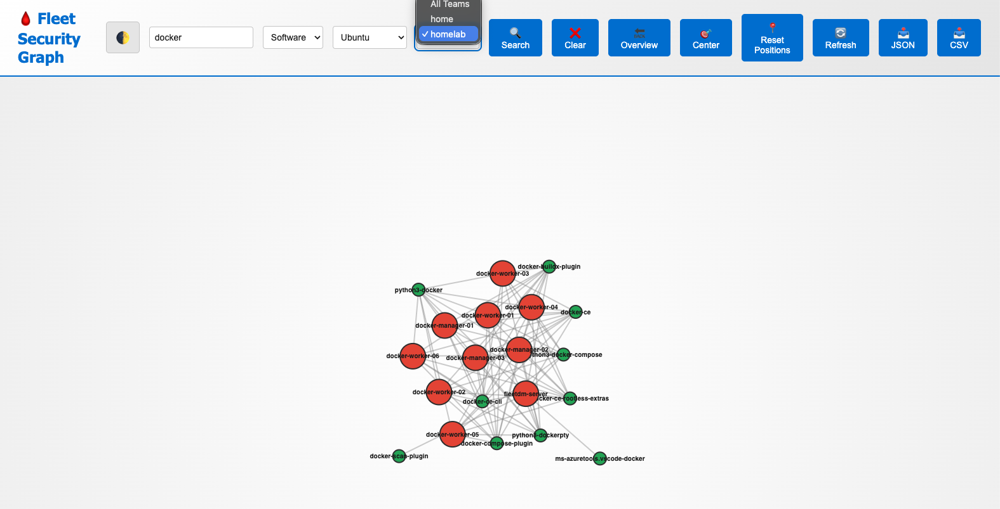
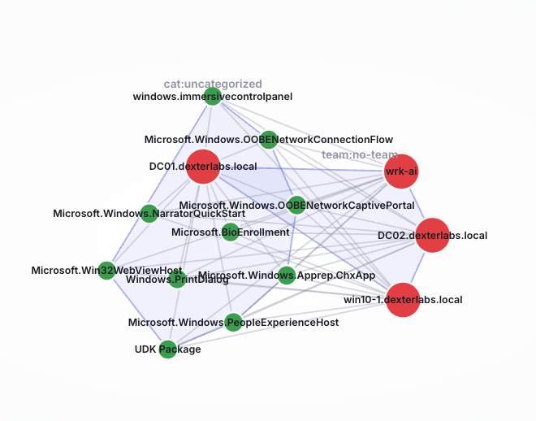
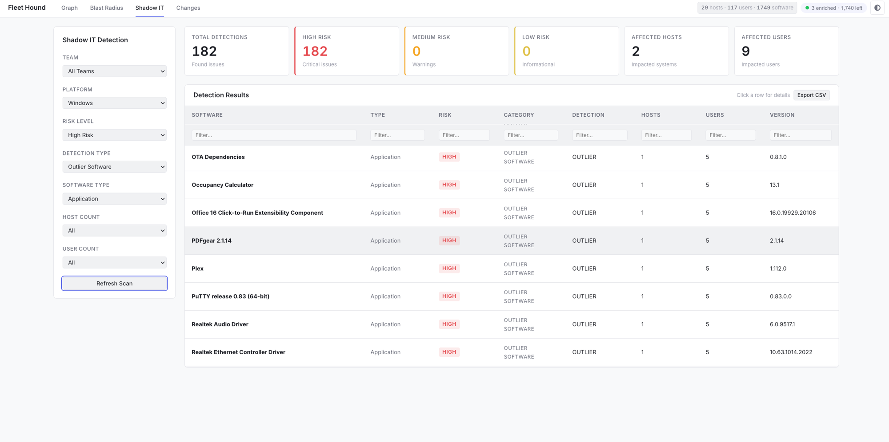
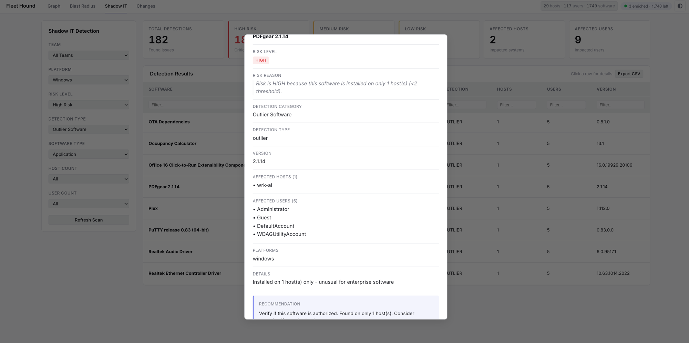

<!-- generated-by: gsd-doc-writer -->
# Fleet Hound 🩸🐶
> **High-Performance Infrastructure Graph Analysis & Risk Quantization for Fleet.**

[](https://fleetdm.com)
[](https://memgraph.com)

Fleet Hound pulls hosts, users, and installed-software inventory from a [Fleet](https://fleetdm.com) MDM/osquery server, builds an `(:User)-[:USES]->(:Host)<-[:INSTALLED_ON]-(:Software)` graph in [Memgraph](https://memgraph.com), enriches software nodes with [Wikidata](https://www.wikidata.org) categories, and serves a Flask dashboard for blast-radius queries, Shadow IT detection, and per-snapshot graph diffs.



---

## Capabilities

| Capability | What it does | Backed by |
|------------|--------------|-----------|
| **Universal Security Graph** | Models every host, user, and software install as nodes/edges in a Bolt-protocol graph DB. | `src/ingestion.py` → Memgraph (`bolt://localhost:7687`) |
| **Differential ETL** | Tracks `last_run_timestamp` per team in `.state.json`, fetches only `updated_at` deltas on subsequent runs. Use `--full-scan` to override. | `main.py`, `src/etl.py`, `src/extractor.py` |
| **Blast Radius & Path Tracing** | Given a compromised host, user, or piece of software, walks the graph to surface every reachable asset across host reach, user impact, lateral movement, and platform spread. | `GET /api/blast-radius`, `GET /api/path` |
| **Shadow IT Detection** | Finds outlier software (low-host-count, uncategorized, or absent from a `whitelist.json`) and ranks risk per host/user. | `GET /api/shadow-it`, `categorize_software.py` |
| **Wikidata Enrichment** | Continuous background worker hits Wikidata SPARQL to attach `category` + `description` properties to `Software` nodes. Single-leader across gunicorn workers via fcntl flock. | `webviz/enrich_worker.py`, `categorize_software.py` |
| **Graph Snapshots & Diff** | Streams the full graph to gzipped JSONL per ETL run; UI surfaces node/edge churn between any two snapshots. | `src/snapshot.py`, `GET /api/snapshots`, `GET /api/diff` |
| **Software Authorization Whitelist** | Operators mark software as approved, mutating Shadow IT scoring on the next read. Persisted atomically. | `POST /api/authorize-software` |
| **Autonomous OODA loop** | Optional in-container supervisor that drives Observe→Orient→Decide→Act cycles on a timer. Pulls deltas, kicks enrichment, computes Shadow IT findings, audits each cycle. | `webviz/ooda_worker.py` |




---

## Architecture

```text
                   ┌──────────────────┐
                   │  Fleet server    │  (REST: /api/v1/fleet/*)
                   └────────┬─────────┘
                            │ Bearer token
                            ▼
                   ┌──────────────────┐
                   │  main.py         │  CLI ETL: extract → ingest → snapshot
                   │  (src/etl.py)    │
                   └────────┬─────────┘
                            │ Bolt
                            ▼
                   ┌──────────────────┐    ┌──────────────────┐
                   │   Memgraph       │◀───│ enrich_worker    │  (Wikidata SPARQL)
                   │   :7687 / :7444  │    │ (fcntl-elected)  │
                   └────────┬─────────┘    └──────────────────┘
                            │ Bolt
                            ▼
                   ┌──────────────────┐
                   │   webviz/app.py  │  Flask + Gunicorn (4 workers)
                   │   :8080          │  Bearer-token auth, /api/*
                   └──────────────────┘
```

Two long-lived services run under Docker Compose: `memgraph` (the graph DB) and `webviz` (the Flask dashboard). The `main.py` CLI is invoked manually or on cron from the host to populate the graph. When `OODA_ENABLED=true` the webviz container also runs the ETL itself on a timer — the host CLI becomes optional.

---

## Quick start

**Prerequisites:** Docker, Docker Compose, Python 3.x, and a Fleet API token.

### Set up Python environment

```bash
# Create virtual environment (required for Homebrew Python 3.10+)
python3 -m venv venv

# Activate it in your shell
source venv/bin/activate  # macOS/Linux
# or: venv\Scripts\activate  # Windows

# Install dependencies
pip install -r requirements.txt
```

### Configure

```bash
# 1. Configure
cp .env.example .env
# Required:    FLEET_URL, FLEET_API_TOKEN
# Strongly recommended for any deployment beyond a single-laptop demo:
#   WEBVIZ_API_TOKEN=$(openssl rand -hex 32)
#   MEMGRAPH_USER=memgraph; MEMGRAPH_PASSWORD=$(openssl rand -hex 32)
$EDITOR .env

# 2. Start Memgraph + the dashboard
./start.sh

# 3. Pull data from Fleet → Memgraph (initial baseline)
python3 main.py --full-scan

# 4. Open the dashboard
open http://localhost:8080
```

The compose file binds webviz to `127.0.0.1:8080` by default — front it with a reverse proxy that terminates TLS and auth before exposing to non-loopback clients.

---

## Operations

### Sync data

```bash
python3 main.py                          # delta sync; uses .state.json cutoff
python3 main.py --teams 1,2              # team-scoped
python3 main.py --full-scan              # ignore cutoff, refetch everything
```

### Wipe and re-baseline

```bash
python3 clear_db.py --yes
python3 main.py --full-scan
```

### Inspect Memgraph

```bash
docker exec -it fleet-memgraph mgconsole --use-ssl=false
> MATCH (n) RETURN labels(n)[0] AS label, count(*) AS n;
```

### Smoke test

```bash
FH_BASE=http://127.0.0.1:8080 FH_TOKEN=$WEBVIZ_API_TOKEN ./scripts/smoke.sh
```

Exit 0 = green. Run after every deploy and as the post-rollback verification step.

### Rotate the API token

1. Generate a new token: `openssl rand -hex 32`
2. Update `.env` (or the secret backing `WEBVIZ_API_TOKEN_FILE`)
3. `docker compose up -d webviz`
4. Update any CI/scripts that consume the token
5. Run `./scripts/smoke.sh`

### Health & logs

| Endpoint | Purpose | Notes |
|---|---|---|
| `GET /api/health` | Container healthcheck | 200 healthy / 503 DB unreachable. Always public. |
| `GET /api/meta` | Topbar pill (counts) | Cheap label-count query. Fronted by auth. |
| `docker logs fleet-webviz` | App logs | gunicorn access + `app` logger structured-ish lines |
| `docker logs fleet-memgraph` | DB logs | tune `--log-level=` in `config/memgraph.conf` |

### App rollback

The data plane is stateful (Memgraph) but the deploy artifact is not. Roll back by re-deploying a previous tagged image of `fleet-webviz`:

```bash
docker compose stop webviz
docker tag fleet-webviz:current fleet-webviz:pre-rollback
docker tag fleet-webviz:<previous-good-tag> fleet-webviz:current
docker compose up -d webviz
./scripts/smoke.sh                      # green is required to declare rollback complete
```

### Data restore

Memgraph keeps `--storage-snapshot-retention-count=3` snapshots in its data volume. If the data layer was corrupted by a bad ingest, restore from the latest snapshot:

```bash
docker compose stop memgraph
VOL=$(docker volume ls --format '{{.Name}}' | grep '_memgraph-data$' | head -1)  # e.g. prod_memgraph-data
docker run --rm -v "$VOL":/data alpine \
  sh -c 'cp /data/snapshots/<latest>.snapshot /data/durable.cypherl || true'
docker compose start memgraph
```

Verify the exact snapshot path with `docker exec fleet-memgraph ls -1 /var/lib/memgraph/snapshots`.

### Incident first responses

| Symptom | First check | Likely cause |
|---|---|---|
| Dashboard 401 from a browser | `WEBVIZ_API_TOKEN` env vs. token entered in browser prompt | Token rotation didn't reach the client |
| Dashboard 503 on every route | `docker logs fleet-memgraph` | Memgraph crash / OOM — see `--memory-limit` in `config/memgraph.conf` |
| Sync hangs on `categorize_software` | Check Wikidata response | Rate-limited; safe to ctrl-c, sync state already saved |
| `cannot add label '<X>'` from Fleet | Reserved Fleet built-in labels | Trying to redeclare a Fleet built-in |
| `/api/relationships` empty | Auth posture mismatch | Add `Authorization: Bearer <token>` |

### Known limitations

- **No multi-tenant auth.** A single shared token gates the API. Build a real session/SSO layer before exposing the dashboard to multiple orgs.
- **Force-graph perf cap** at 800 nodes for the overview view — search/expand to drill in.
- **Wikidata enrichment is best-effort.** Rate limits and missing entries are normal; categorization runs degrade gracefully.
- **`.state.json` is per-CWD.** Run `main.py` from the same working directory across syncs (the `prod/` dir).



---

## CLI reference (`main.py`)

| Flag | Purpose |
|------|---------|
| `--fleet-url URL` | Fleet base URL. Falls back to `FLEET_URL` in `.env`. |
| `--api-token TOKEN` | Fleet API token (recommended). Falls back to `FLEET_API_TOKEN`. |
| `--email`, `--password` | Legacy email/password login via `POST /api/v1/fleet/login`. |
| `--memgraph-uri URI` | Bolt URI. Default `bolt://localhost:7687`. |
| `--insecure` | Skip TLS verify (self-signed Fleet certs only). |
| `--debug-auth` | Print auth status code + 300-char body snippet for diagnostics. |
| `--teams 1,2,3` | Restrict extraction to specific Fleet team IDs. |
| `--full-scan` | Ignore `.state.json` and re-fetch every host. |
| `--complete-enrichment` | After ingest, enrich **every** uncategorized `Software` node via Wikidata (slow). Default caps at 250 outliers. |
| `--enrich-software "Slack,Zoom"` | Force Wikidata enrichment for specific names. |
| `--dump-host-sample` | Write the first host object to `hosts_sample.json` and exit. |

### Other entry points

```bash
# Run only the Wikidata categorizer (no Fleet pull, no ingest).
python3 categorize_software.py
python3 categorize_software.py --limit 0   # all uncategorized
```

---

## Configuration (`.env`)

| Variable | Required | Notes |
|----------|----------|-------|
| `FLEET_URL` | yes | Base URL of your Fleet server. |
| `FLEET_API_TOKEN` | yes | Bearer token. Alternative: `FLEET_EMAIL` + `FLEET_PASSWORD`. |
| `MEMGRAPH_URI` | no | Default `bolt://localhost:7687`. |
| `MEMGRAPH_USER` / `MEMGRAPH_PASSWORD` | no | Bolt auth. Use `MEMGRAPH_PASSWORD_FILE` for mounted secrets. |
| `WEBVIZ_API_TOKEN` | no | When set, every `/api/*` call must send `Authorization: Bearer <token>` or `X-Api-Token: <token>`. |
| `WEBVIZ_REQUIRE_AUTH` | no | `true` refuses to start unless a token is configured. |
| `WEBVIZ_ALLOW_ANONYMOUS_READ` | no | `true` allows GETs from any client when no token is set (default: loopback only). |
| `PORT` | no | Dashboard listen port. Default `8080`. |
| `DEBUG` | no | `true` to enable extractor + auth diagnostics. |
| `ENRICHER_ENABLED` / `_INTERVAL_SEC` / `_BATCH_SIZE` | no | Wikidata categorizer worker tuning. |
| `OODA_ENABLED` / `_INTERVAL_SEC` / `_FULL_SCAN_EVERY` / `_TEAMS` | no | Autonomous supervisor (see below). |

See `.env.example` for the canonical list and defaults.

---

## Dashboard API surface (selected)

All routes are under `/api/`. With a token configured, send it as `Authorization: Bearer <token>` or `X-Api-Token: <token>`.

| Route | Purpose |
|-------|---------|
| `GET /api/health` | DB ping. Used by Docker healthcheck. |
| `GET /api/meta` | Counts for the topbar pill. |
| `GET /api/blast-radius?type=…&id=…` | Reachability set from a seed node. |
| `GET /api/path?from=…&to=…` | Shortest path between two typed IDs. |
| `GET /api/shadow-it` | Outlier-software ranking with whitelist suppression. |
| `POST /api/authorize-software` | Mark software as approved. |
| `GET /api/snapshots`, `GET /api/diff?a=…&b=…` | Snapshot list and per-property diff. |
| `GET /api/ooda/status`, `/findings`, `/cycles`, `POST /trigger` | OODA supervisor introspection. |
| `GET /api/enricher/status`, `POST /api/enricher/trigger` | Wikidata enricher introspection. |



See `webviz/README.md` for the full route list and request/response shapes.

---

## Autonomous mode (OODA)

For unattended operation, set the OODA supervisor flags in `.env`:

```ini
OODA_ENABLED=true
OODA_INTERVAL_SEC=1800        # 30-minute cycle
OODA_FULL_SCAN_EVERY=24       # refresh per-team watermarks every ~12h
```

`docker compose up -d` then runs the loop in-process (Observe → Orient → Decide → Act). Cycle state is exposed at `GET /api/ooda/status` and `GET /api/ooda/cycles`; trigger an out-of-band cycle with `POST /api/ooda/trigger` (60s cooldown).

---

## Repository layout

```text
prod/
├── main.py                  # CLI ETL entrypoint (thin shim over src/etl.py)
├── categorize_software.py   # Wikidata enrichment
├── clear_db.py              # wipe Memgraph
├── start.sh / stop.sh       # docker compose wrappers
├── docker-compose.yml       # memgraph + webviz services
├── src/                     # ETL logic (etl, extractor, ingestion, snapshot, auth)
├── webviz/                  # Flask routes, gunicorn workers, OODA + enricher
├── config/                  # Memgraph conf & OODA logs
├── scripts/smoke.sh         # post-deploy smoke test
└── assets/                  # README screenshots
```

---

## License

Released under the [MIT License](LICENSE). Copyright (c) 2025 Fleet Hound Contributors.
