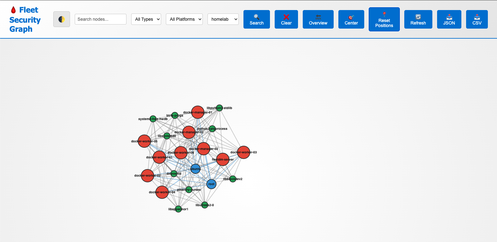
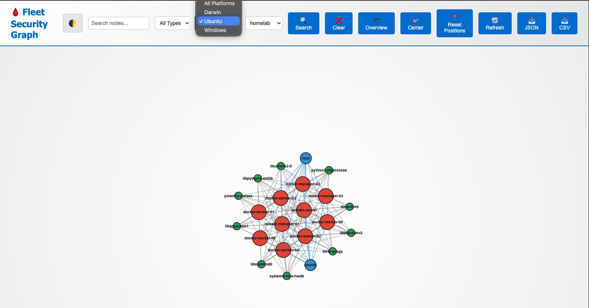
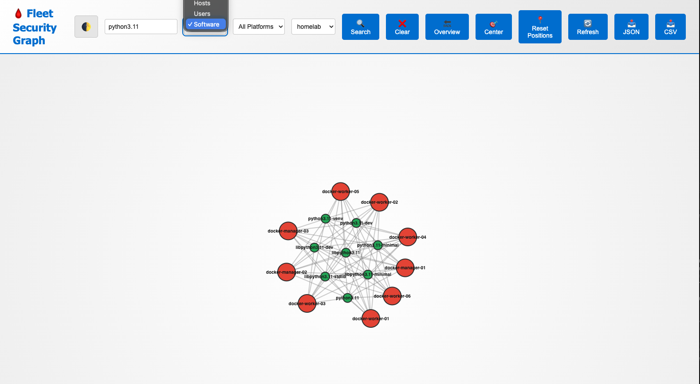
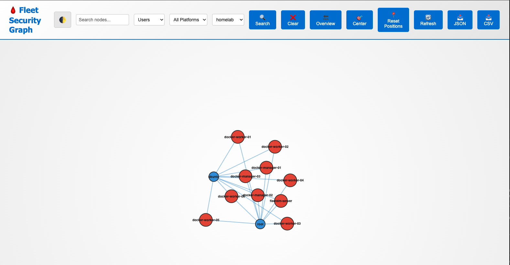

# Fleet Hound 🩸🐶

**Fleet Hound** is a high-performance graph visualization and analysis tool for **FleetDM** (Fleet Device Management). It extracts inventory data (Hosts, Users, Software) from your Fleet instance and maps their relationships in a **Memgraph** graph database, allowing you to visualize and query your infrastructure's security posture.

<p align="center">
  
</p>

## 🚀 Features

*   **Graph Visualization**: Visualize your Fleet infrastructure as a graph (Hosts, Users, Software).
*   **Relationship Mapping**: Automatically links:
    *   `(:User)-[:USES]->(:Host)`
    *   `(:Software)-[:INSTALLED_ON]->(:Host)`
*   **Differential Ingestion**: Optimized sync engine that supports both Full Scans and fast, state-aware Incremental Scans.
*   **Parallel Processing**: High-performance multi-threaded extraction for massive datasets (10k+ nodes).
*   **Team Filtering**: Granular control to sync specific Fleet Teams or the entire organization.
*   **Web Dashboard**: Built-in interactive WebUI (`webviz`) to explore the `Fleet Security Graph`.
*   **Dockerized**: Fully containerized stack for easy deployment.

## � Screenshots

| Graph Analysis | Host Details |
|:---:|:---:|
|  |  |

| Software Mapping | User Relationships |
|:---:|:---:|
|  |  |

## �🛠️ Prerequisites

*   **Docker** & **Docker Compose**
*   **FleetDM Instance** (API Token required)
*   **Python 3.9+** (if running locally without Docker)

## 📦 Quick Start

### 1. Configure
Copy the example configuration:
```bash
cp .env.example .env
```
Edit `.env` and add your **Fleet URL** and **API Token**:
```ini
FLEET_URL=https://fleet.example.com
FLEET_API_TOKEN=your_token_here
```

### 2. Start Services
Launch the Memgraph database and WebUI:
```bash
./start.sh
```
*   **Memgraph**: `bolt://localhost:7687`
*   **Dashboard**: `http://localhost:8080`

### 3. Ingest Data
Run the crawler to populate the graph:

**Full Scan (Initial Run):**
```bash
python3 main.py --full-scan
```

**Differential Sync (Subsequent Runs):**
```bash
python3 main.py
```

**Sync Specific Teams:**
```bash
python3 main.py --teams 1,2
```

### 4. Utility Scripts

**Stop Services:**
```bash
./stop.sh
```

**Clear Database:**
```bash
python3 clear_db.py
```

## 🏗️ Architecture

*   **Extractor**: Python-based ETL engine using `ThreadPoolExecutor` for parallel API fetching.
*   **Database**: **Memgraph** (In-memory implementation of Bolt/Cypher).
*   **Frontend**: Flask + D3.js (or similar) for the `webviz` dashboard.
*   **Deployment**: Docker Compose.

## 🛡️ Security

*   Data is stored locally in the `memgraph-data` Docker volume.
*   API Tokens are managed via `.env` (never committed).
*   Supports `--insecure` flag for self-signed Fleet certs (Dev only).

## 📄 License

MIT License. See [LICENSE](LICENSE) for details.
